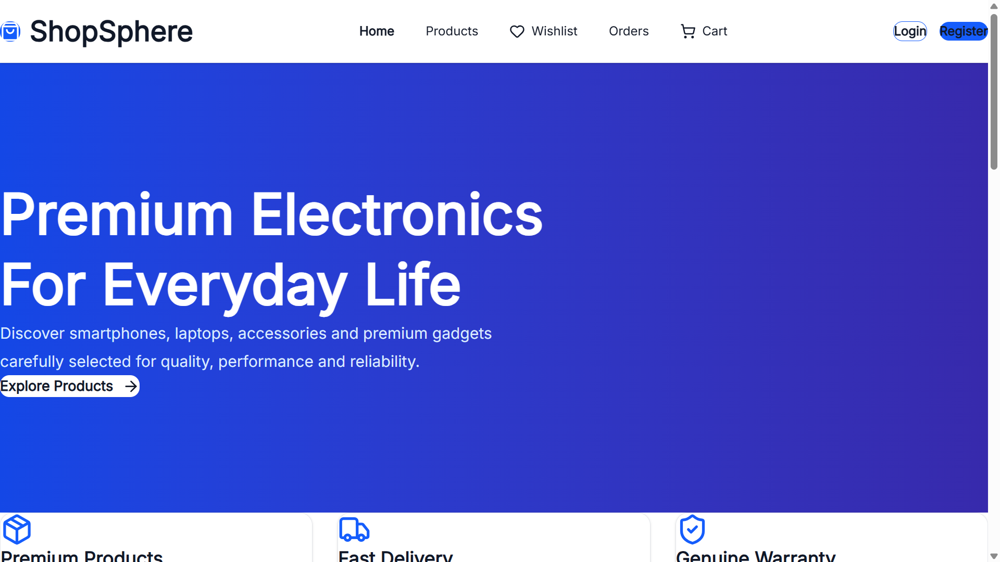
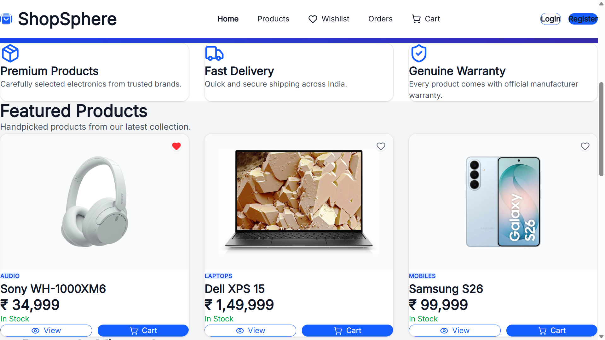
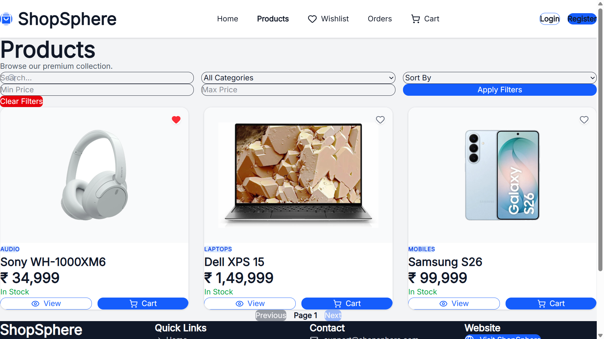
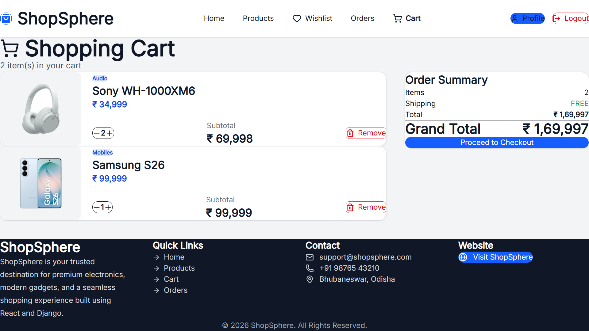
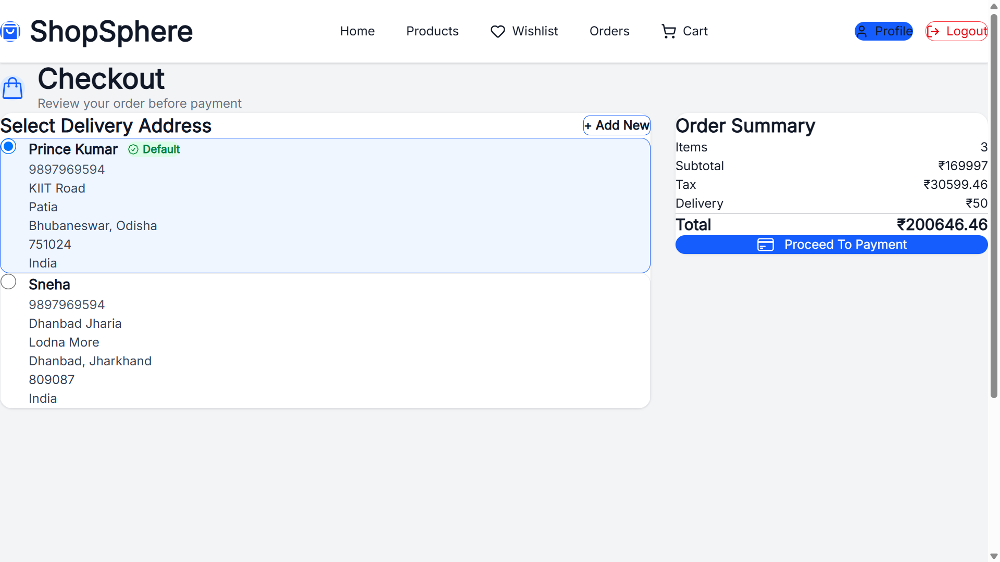
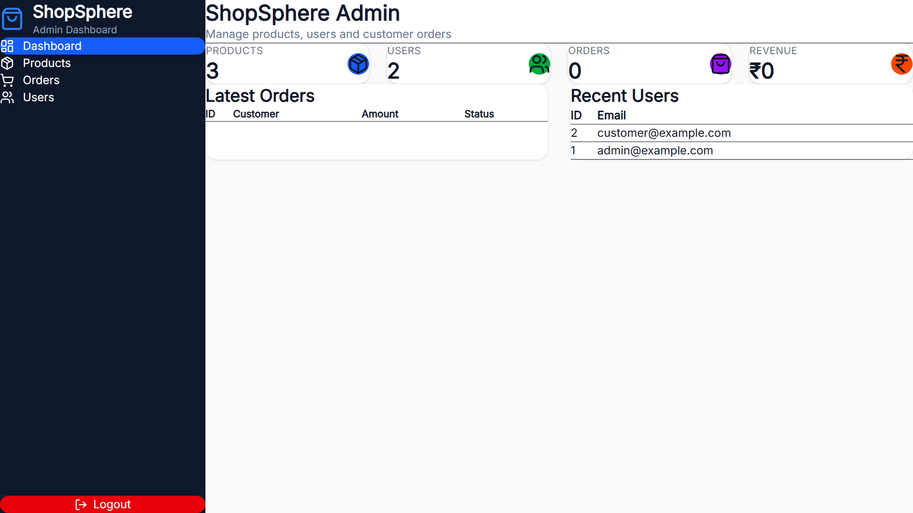
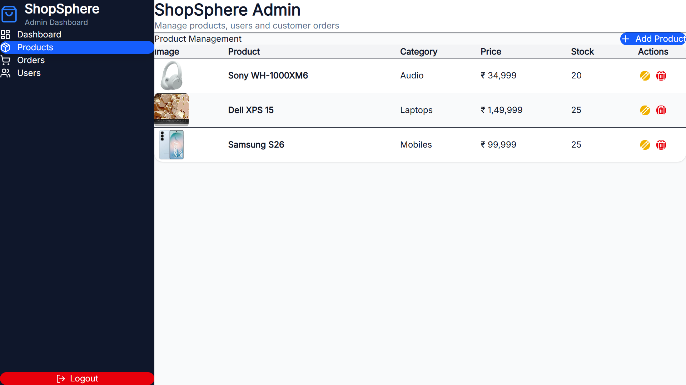
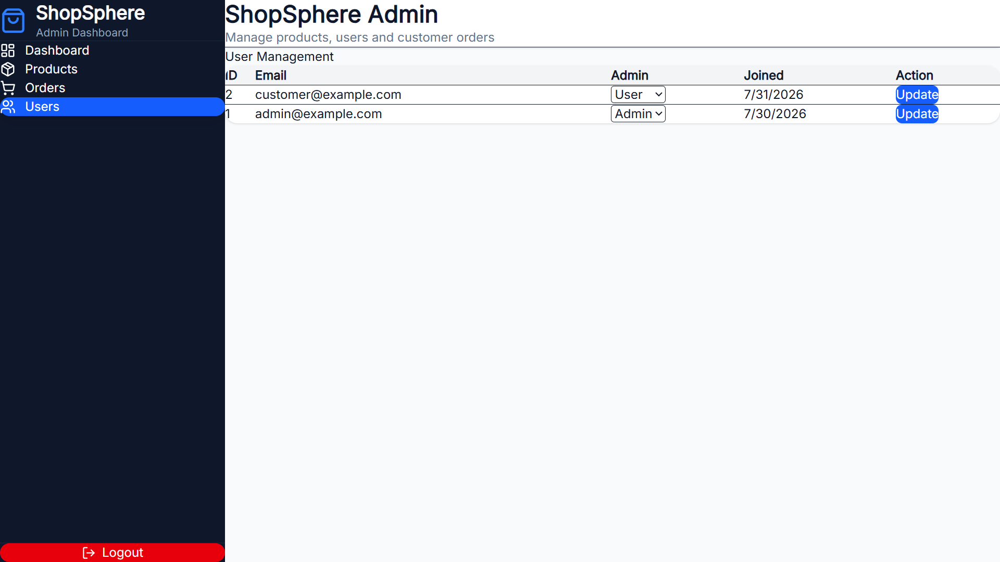

# ShopSphere

A full-stack e-commerce platform built using React, Django REST Framework, and PostgreSQL.

ShopSphere is a complete online shopping application that provides a modern shopping experience with secure authentication, product browsing, wishlist management, shopping cart, checkout, Razorpay payment integration, order management, and an admin dashboard for managing the platform.

---

## Features

### Customer

- User Registration and Login (JWT Authentication)
- Browse Products
- Product Search and Filtering
- Wishlist
- Recently Viewed Products
- Shopping Cart
- Address Management
- Secure Checkout
- Razorpay Payment Integration
- Order History
- User Profile Management

### Admin

- Admin Dashboard
- Product Management
- User Management
- Order Management
- Secure Admin APIs

---

## Tech Stack

### Frontend

- React.js
- Vite
- Tailwind CSS
- Axios
- React Router
- Framer Motion
- React Hot Toast

### Backend

- Django
- Django REST Framework
- PostgreSQL
- JWT Authentication
- Razorpay API

---

## Project Structure

```text
ShopSphere
│
├── backend
│   ├── apps
│   ├── config
│   ├── products
│   └── manage.py
│
├── frontend
│   ├── public
│   ├── src
│   └── package.json
│
└── README.md
```

---

## Getting Started

### Clone the repository

```bash
git clone https://github.com/r-prince3927/Shop-Sphere.git
```

---

### Backend Setup

```bash
cd backend

python -m venv prince

prince\Scripts\activate

pip install -r requirements.txt

python manage.py migrate

python manage.py runserver
```

---

### Frontend Setup

```bash
cd frontend

npm install

npm run dev
```

---

## Environment Variables

Create a `.env` file inside the `backend` folder.

```env
SECRET_KEY=

DEBUG=True

DB_NAME=

DB_USER=

DB_PASSWORD=

DB_HOST=

DB_PORT=

RAZORPAY_KEY_ID=

RAZORPAY_KEY_SECRET=
```

---

## Current Features

- JWT Authentication
- Product Catalog
- Product Details
- Search & Filters
- Wishlist
- Shopping Cart
- Address Management
- Razorpay Payment Integration
- Order Management
- Admin Dashboard
- Responsive User Interface

---

## Future Improvements

- Product Ratings & Reviews
- AI-based Product Recommendations
- Discount Coupons
- Inventory Analytics
- Email Notifications
- Docker Deployment
- CI/CD Pipeline
- Unit & Integration Testing

---
# Screenshots

## Home





---

## Products



---

## Product Details


---

## Wishlist


---

## Cart



---

## Checkout



---

## Admin Dashboard



---

## Admin Products



---

## Admin Users



---

## Author

**Prince Kumar**

B.Tech Computer Science Engineering

Full Stack Developer

GitHub: https://github.com/r-prince3927